# 全图型汇总 (all-in-one)

> 长文档验收: 多图表批量渲染性能、滚动、目录、复制链路。

## 流程图

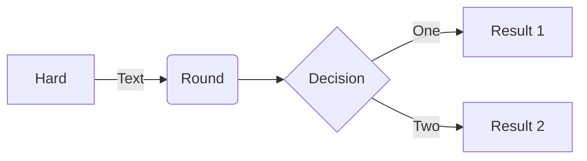

## 时序图

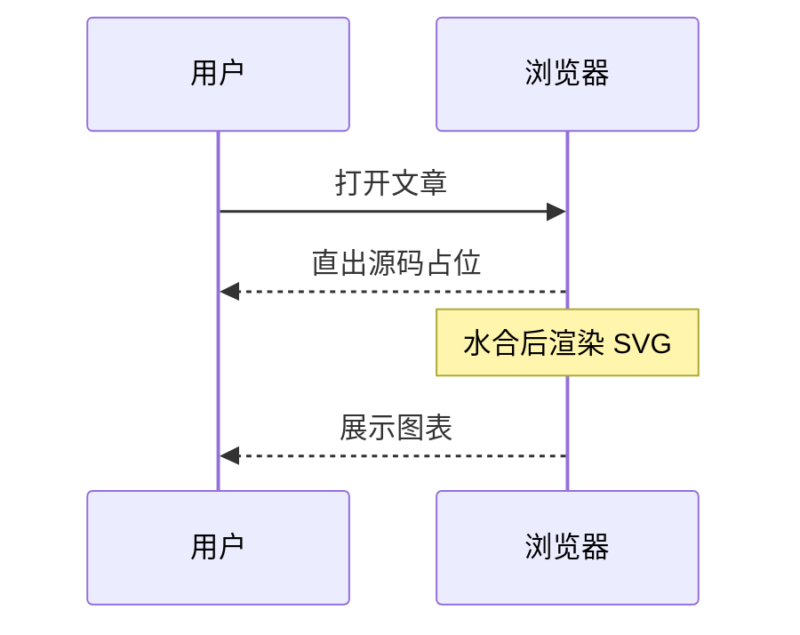

## 类图

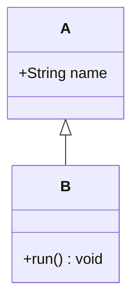

## 状态图

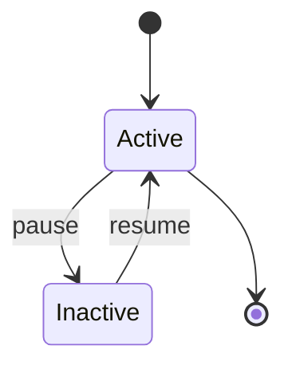

## ER 图

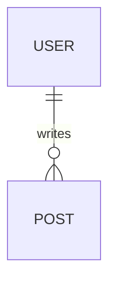

## 甘特图

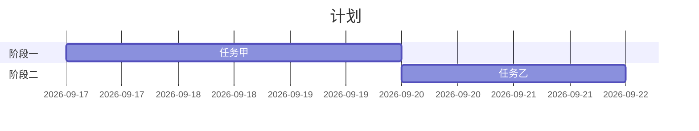

## 饼图

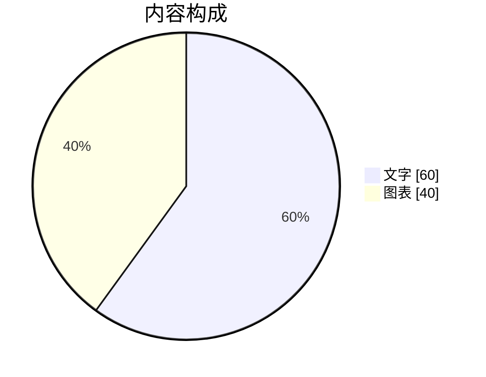

## 用户旅程

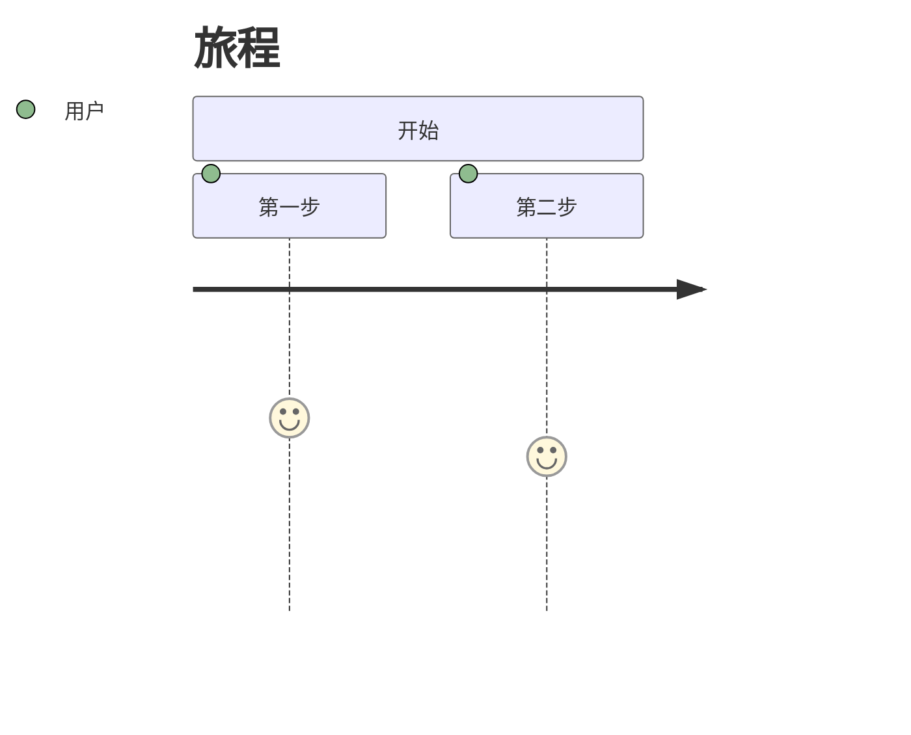

## 思维导图

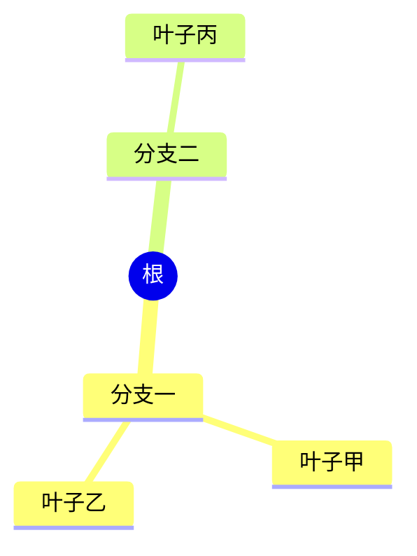

## 时间线

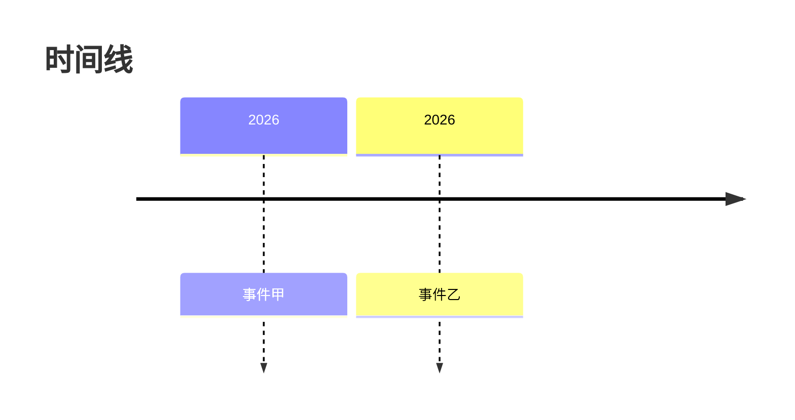

## Git 图

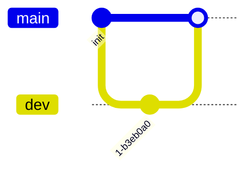

## 桑基图

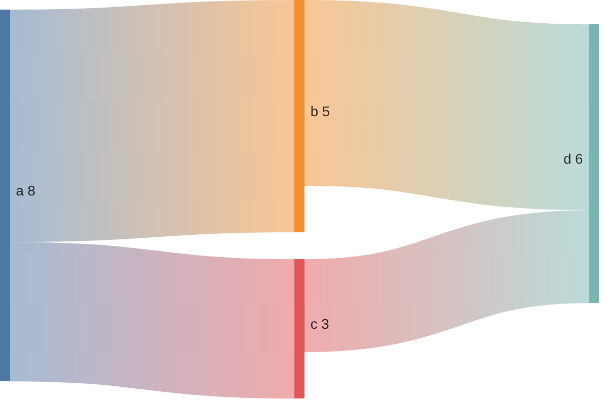

## 象限图

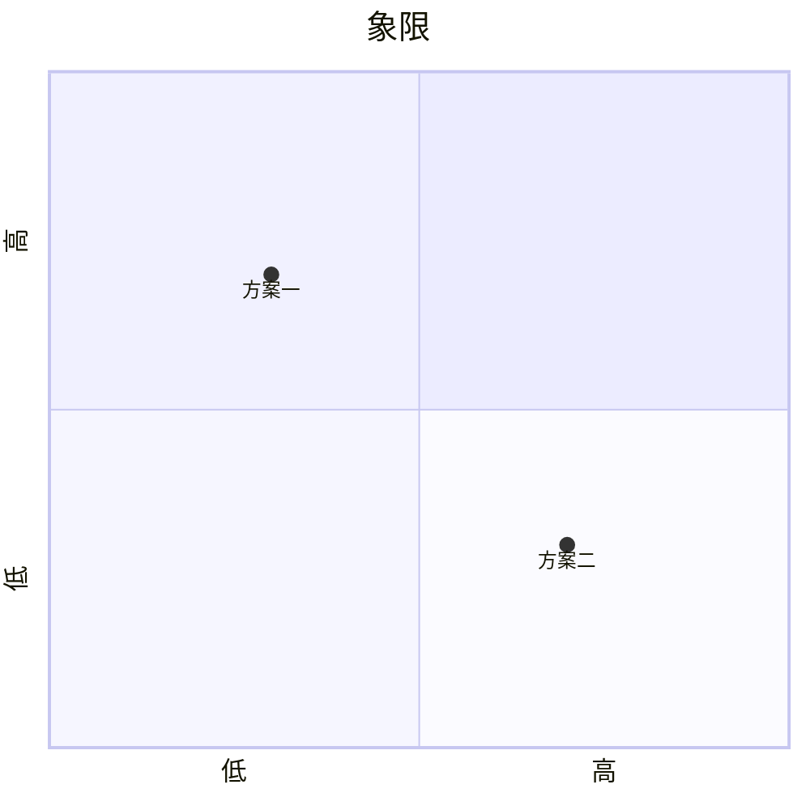

## XY 图表

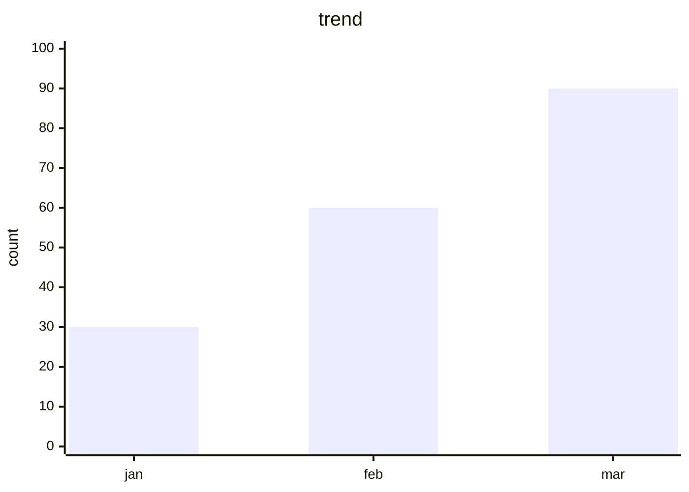

## 错误降级 (应显示源码与错误信息)

```mermaid
flowchart LR
    A[未闭合 -->
```
