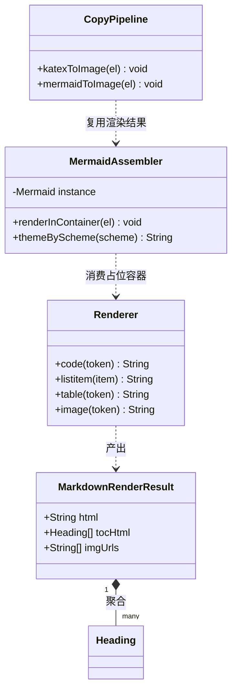

# 类图 (classDiagram)

```mermaid
classDiagram
    class MarkdownRenderResult {
        +String html
        +Heading[] tocHtml
        +String[] imgUrls
    }

    class Renderer {
        +code(token) String
        +listitem(item) String
        +table(token) String
        +image(token) String
    }

    class MermaidAssembler {
        -Mermaid instance
        +renderInContainer(el) void
        +themeByScheme(scheme) String
    }

    class CopyPipeline {
        +katexToImage(el) void
        +mermaidToImage(el) void
    }

    Renderer ..> MarkdownRenderResult : 产出
    MermaidAssembler ..> Renderer : 消费占位容器
    CopyPipeline ..> MermaidAssembler : 复用渲染结果
    MarkdownRenderResult "1" *-- "many" Heading : 聚合
```
