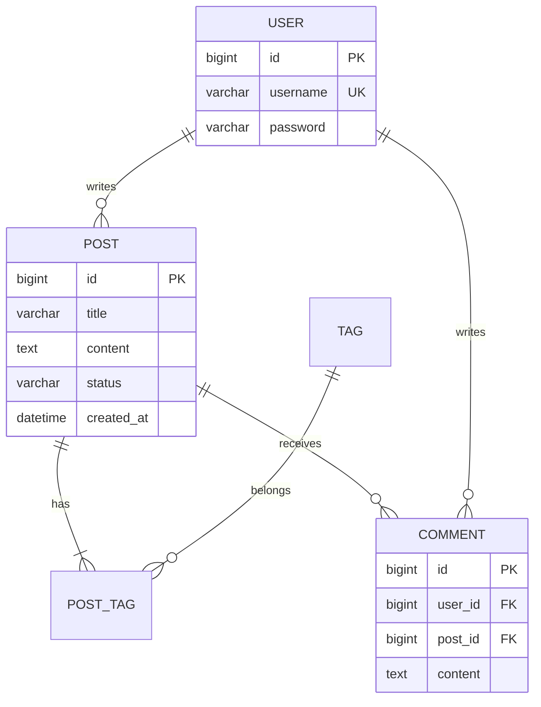

# 实体关系图 (erDiagram)

```mermaid
erDiagram
    USER ||--o{ POST : writes
    POST ||--|{ POST_TAG : has
    TAG ||--o{ POST_TAG : belongs
    POST ||--o{ COMMENT : receives
    USER ||--o{ COMMENT : writes
    POST {
        bigint id PK
        varchar title
        text content
        varchar status
        datetime created_at
    }
    USER {
        bigint id PK
        varchar username UK
        varchar password
    }
    COMMENT {
        bigint id PK
        bigint user_id FK
        bigint post_id FK
        text content
    }
```
