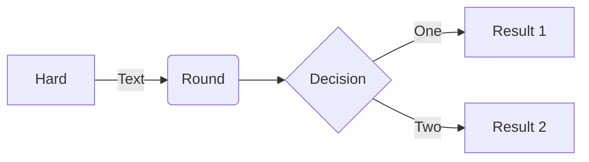
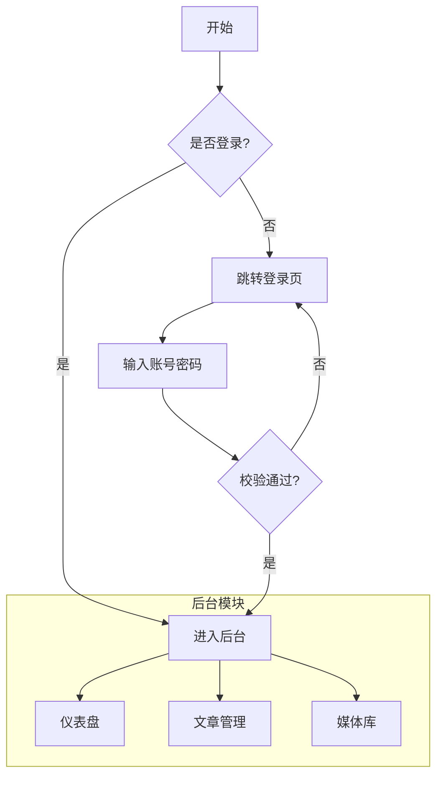
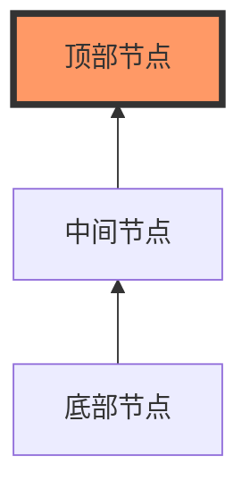

# 流程图 (flowchart)

任务文件中的原始示例:

```mermaid
flowchart LR

A[Hard] -->|Text| B(Round)
B --> C{Decision}
C -->|One| D[Result 1]
C -->|Two| E[Result 2]
```

子图与中文标签:

```mermaid
flowchart TD
    A[开始] --> B{是否登录?}
    B -- 是 --> C[进入后台]
    B -- 否 --> D[跳转登录页]
    D --> E[输入账号密码]
    E --> F{校验通过?}
    F -- 是 --> C
    F -- 否 --> D

    subgraph 后台模块
        C --> G[仪表盘]
        C --> H[文章管理]
        C --> I[媒体库]
    end
```

方向与样式变体:

```mermaid
flowchart BT
    A1[底部节点] --> A2[中间节点] --> A3[顶部节点]
    style A3 fill:#f96,stroke:#333,stroke-width:4px
```
