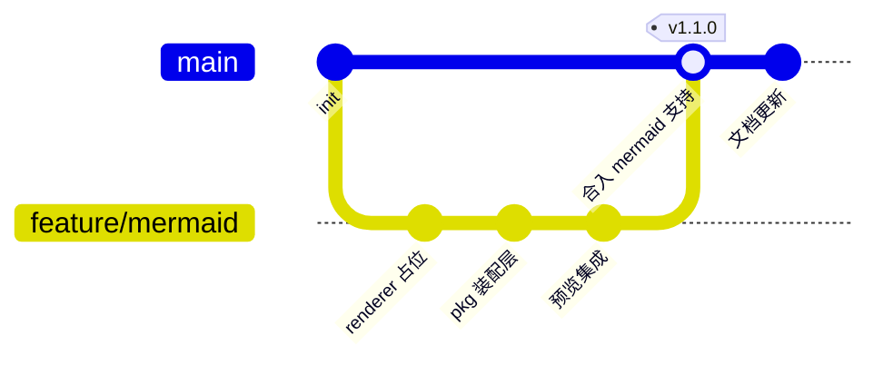

# Git 分支图 (gitGraph)

```mermaid
gitGraph
    commit id: "init"
    branch feature/mermaid
    checkout feature/mermaid
    commit id: "renderer 占位"
    commit id: "pkg 装配层"
    commit id: "预览集成"
    checkout main
    merge feature/mermaid id: "合入 mermaid 支持" tag: "v1.1.0"
    commit id: "文档更新"
```
