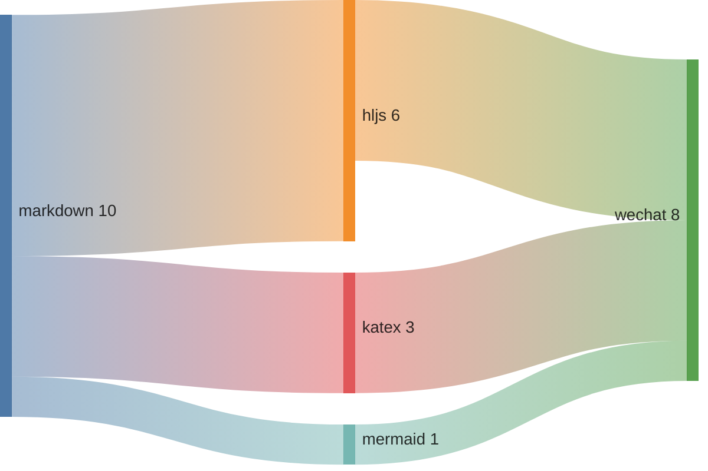
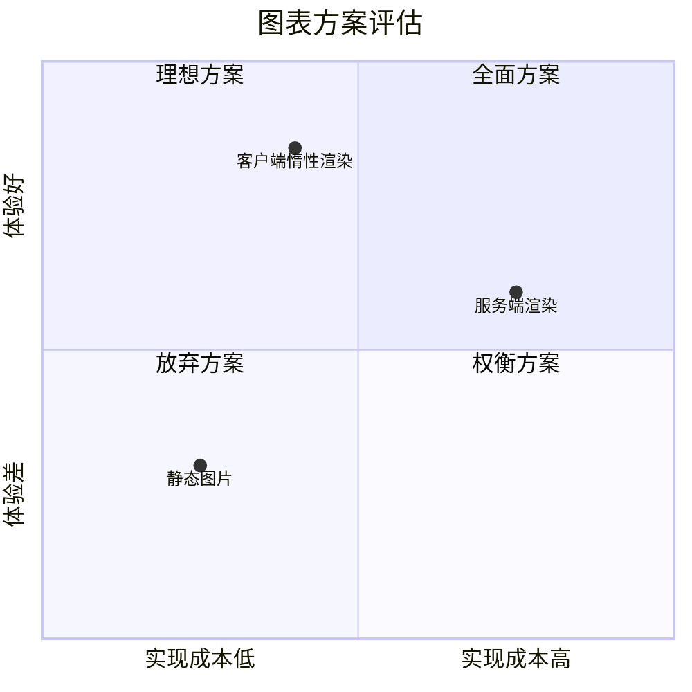
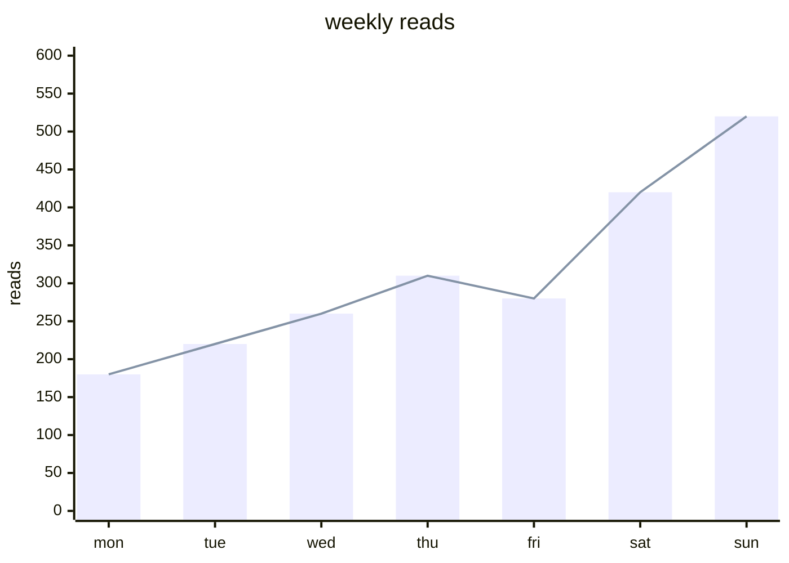

# 较新图型 (sankey / quadrant / xychart)

桑基图 (mermaid 12 语法: sankey 节点名仅支持 ASCII, 不支持中文):

```mermaid
sankey-beta
    markdown,hljs,6
    markdown,katex,3
    markdown,mermaid,1
    hljs,wechat,4
    katex,wechat,3
    mermaid,wechat,1
```

象限图:

```mermaid
quadrantChart
    title 图表方案评估
    x-axis 实现成本低 --> 实现成本高
    y-axis 体验差 --> 体验好
    quadrant-1 全面方案
    quadrant-2 理想方案
    quadrant-3 放弃方案
    quadrant-4 权衡方案
    静态图片: [0.25, 0.3]
    服务端渲染: [0.75, 0.6]
    客户端惰性渲染: [0.4, 0.85]
```

XY 图表 (xychart 轴标签与标题仅支持 ASCII):

```mermaid
xychart-beta
    title "weekly reads"
    x-axis [mon, tue, wed, thu, fri, sat, sun]
    y-axis "reads" 0 --> 600
    bar [180, 220, 260, 310, 280, 420, 520]
    line [180, 220, 260, 310, 280, 420, 520]
```
