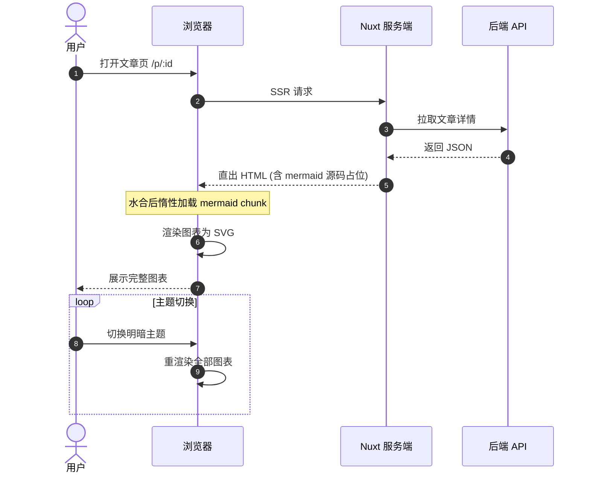

# 时序图 (sequenceDiagram)



激活与备用流:

```mermaid
sequenceDiagram
    participant C as 客户端
    participant R as 刷新管理器

    C->>+R: 401 触发刷新
    R->>R: 防抖合并并发刷新
    alt 刷新成功
        R-->>-C: 重放挂起请求
    else 刷新失败
        R-->>-C: 广播登出
    end
```
