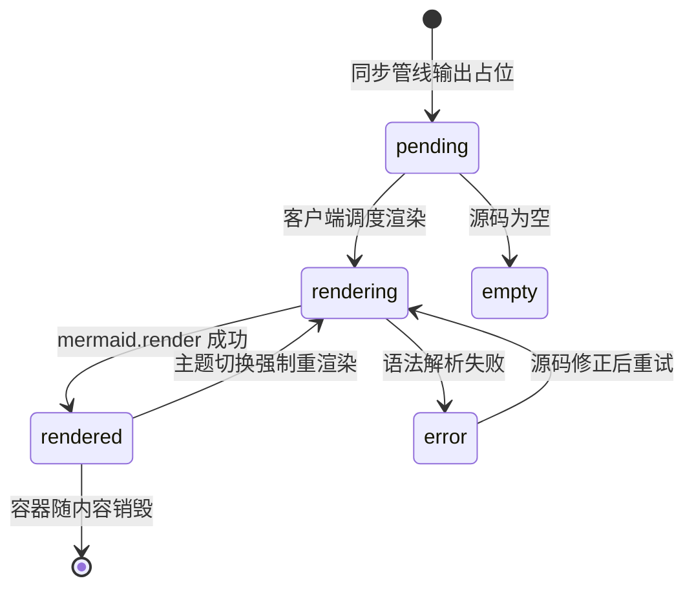

# 状态图 (stateDiagram-v2)

```mermaid
stateDiagram-v2
    [*] --> pending: 同步管线输出占位
    pending --> rendering: 客户端调度渲染
    rendering --> rendered: mermaid.render 成功
    rendering --> error: 语法解析失败
    rendered --> rendering: 主题切换强制重渲染
    error --> rendering: 源码修正后重试
    pending --> empty: 源码为空
    rendered --> [*]: 容器随内容销毁
```
